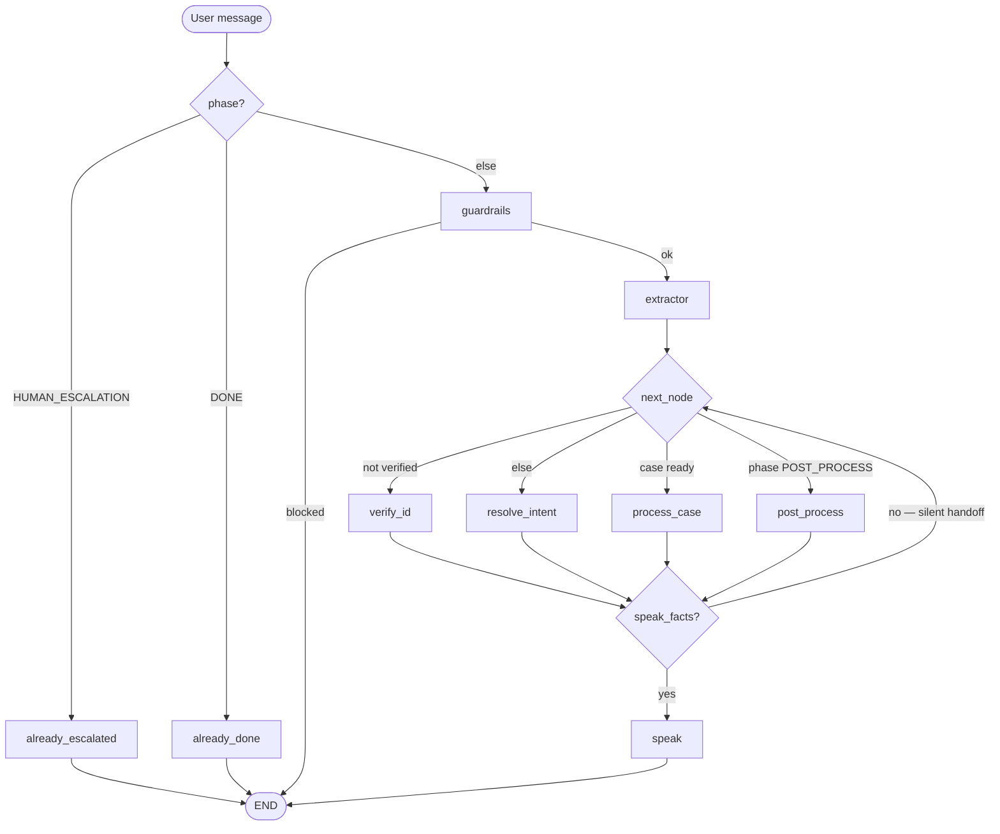

# Architecture

High-level view of the SOP-guided claims agent: phases are code-gated; nodes gather facts; `speak` phrases one reply per turn, then the graph stops.

## Turn flow

**Rule:** non-empty `speak_facts` → phrase once via `speak` → END. Empty facts → continue to the next SOP node in the same turn.

## Phases

| Phase              | Meaning                                  |
| ------------------ | ---------------------------------------- |
| `VERIFY_ID`        | Collect and match identity (start state) |
| `RESOLVE_INTENT`   | Pick claim or policy intent              |
| `PROCESS_CASE`     | Answer from the selected claim file      |
| `POST_PROCESS`     | Offer email summary, then close          |
| `HUMAN_ESCALATION` | Hand off to a person (terminal)          |
| `DONE`             | Call finished (terminal)                 |

Order: `VERIFY_ID` → `RESOLVE_INTENT` → `PROCESS_CASE` → `POST_PROCESS` → `DONE`  
Escape hatch: `HUMAN_ESCALATION` from guardrails / affect / explicit ask.

## Routing conditions (`next_node`)

| Condition                                                                      | Next node        |
| ------------------------------------------------------------------------------ | ---------------- |
| `halt` or phase in `{HUMAN_ESCALATION, DONE}`                                  | END              |
| `verified == false`                                                            | `verify_id`      |
| `phase == POST_PROCESS`                                                        | `post_process`   |
| `phase == PROCESS_CASE` and (`selected_case_id` or `intent == policy_inquiry`) | `process_case`   |
| otherwise (verified, case not ready)                                           | `resolve_intent` |

## Nodes

### `guardrails`

- Screens jailbreak, prompt injection, off-topic.
- **Blocked:** reply and stop; after 3 strikes → `HUMAN_ESCALATION`.
- **Allowed:** continue to `extractor`.

### `extractor`

- Pulls identity, caller role, and claim hints (`case_id`, type, status, month, year) into state/memory.
- Always continues (unless already terminal).

### `verify_id`

- Needs **3 matching PII** among: name, DOB, phone, email, SSN last four. Policy number helps lookup but does not count.
- **Verified:** set `party_id`, `phase = RESOLVE_INTENT`.
  - If claim hints already noted → silent handoff to `resolve_intent`.
  - Else → speak “identity confirmed”.
- **Need more / mismatch / not on file:** speak and stop.
- Strong negative affect can escalate to `HUMAN_ESCALATION`.

### `resolve_intent`

- Infers `claim_issue`, `claim_status`, or `policy_inquiry` from hints/memory.
- Filters the party’s claims by named hints (id / type / status / month / year).
- **Unique match (or known** `case_id`**):** set `selected_case_id`, `phase = PROCESS_CASE`, silent handoff to `process_case`.
- **Ambiguous / no hints:** ask for claim id or type (speak and stop).
- `policy_inquiry`**:** no claim file; hand off to `process_case`.

### `process_case`

- Loads the selected claim; first visit briefs outcome (status, denial reason, documents, deadlines).
- Follow-ups answer from the same file.
- When the caller is done → `phase = POST_PROCESS` (silent handoff).
- Out-of-scope on-claim topics can offer human handoff.

### `post_process`

- Offer email summary (`send` / `skip`).
- Choice recorded → `phase = DONE`, speak closeout.

